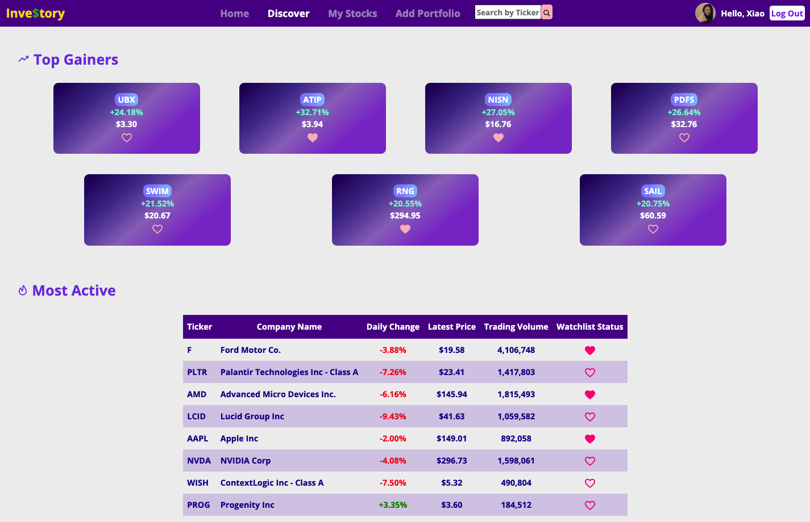
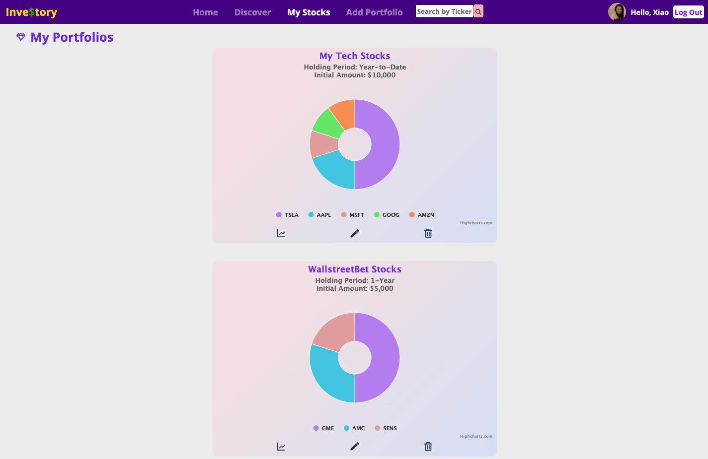
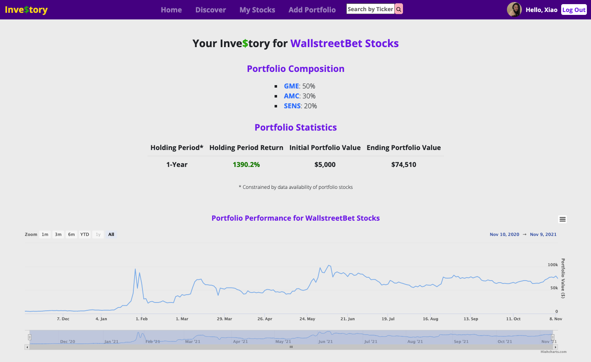

<p align="center">
  <h1 align="center">Inve$tory</h1>

  <p align="center">
    <a href="https://investory-app.herokuapp.com/">View Demo</a>
    ·
    <a href="https://github.com/xiaozhong21/Investory/issues">Report Bug</a>
    ·
    <a href="https://github.com/xiaozhong21/Investory/issues">Request Feature</a>
  </p>
  
</p>

[![Deploy to Heroku][deploy-badge]][deploy-workflow]
[![Reset Heroku DB][reset-badge]][reset-workflow]

## Contents

  - [About](#about)
  - [Features](#features)
  - [Built with](#built-with)
  - [Getting Started](#getting-started)

## About
Want to learn about stock market investing and wonder how your investment ideas would have played out in a particular time period? Inve$tory is an educational tool that features portfolio backtesting and stock tracking.

My inspiration of building this passion project originates from being asked by my friends to recommend "the next Bitcoin" or "the next [GME](https://en.wikipedia.org/wiki/GameStop_short_squeeze)". In stock marketing investing, new investors are easily intrigued by the return but are not usually aware of the risks involved. 

By building **Inve$tory**, I hope to provide a fun beginner-friendly visualization tool for users to learn about not only the *return* (ending value - initial value) of a portfolio strategy, but more importantly, the *risk* (how the performance chart fluctuates throughout the time frame) involved.

## Features
Users can
- View a list of daily top gainers and active stocks, and conveniently add them to watchlist
<div align="center">  </div>

- Create a watchlist of stocks that allows for individual stock chart view
   - Add gainers/active stocks directly to watchlist
   - Add a stock to watchlist by searching for a ticker in top search bar
   - Delete stocks from watchlist
- Create customized portfolios and back-test portfolio performance in the specified time frame
   - Customize asset allocations of portfolio stocks
   - Specify preferred time frame and initial investment amount
   - Visualize portfolio performance: portfolio composition, return, performance chart, etc.
<div align="center">  </div>
<div align="center">  </div>

- View individual stock details
   - Price chart and daily price changes
   - Company profile
   - Stock stats including open/52-week-high/52-week-low prices, year-to-date changes, market cap, P/E ratio, trading volume
   - Latest news

## Built With
Inve$tory was built using a PostgreSQL, Express, React, and Node (PERN) stack. 

It also uses
* [IEX Cloud API](https://iexcloud.io/)
* [Auth0](https://auth0.com/docs/get-started)
* [Highcharts](https://www.highcharts.com/)
* [React Hook Form](https://react-hook-form.com/)

## Getting Started

### Prerequisites
**Docker**

This project relies on Docker to run the PostgreSQL server. You must install Docker first before continuing.

Use one of these methods:

- Use [Homebrew][] on macOS: `brew install --cask docker`
- [Follow the instructions on the Docker website][docker-www]

Once you've installed Docker Desktop, you'll need to launch the app. On macOS,
it's located in `/Applications/Docker`.

**Node**

You'll need to install Node v14 or above. [`nvm`][nvm] is highly recommended.

### Set Up the Development Environment

1. **Clone the repo:**
   ```sh
   git clone https://github.com/xiaozhong21/Investory.git
   ```
2. **Install all NPM packages using this in the root directory:**
   ```sh
   npm install
   ```
3. **Database setup:**
   1. Copy the root example environment file

   ```sh
   cp .env.example .env
   ```
   2. You can choose to edit `POSTGRES_DB` and `POSTGRES_PASSWORD` or just use as-is.
[See the PostgreSQL Docker image documentation for more
information][dh-postgres].
   3. Run the following to setup the database with the seed file:
   ```sh
   npm run db:init
   ```
   ℹ️ If you ever need to start over with the database, you can run this command
again which will delete your existing data and start from scratch.

4. **Environment variables setup.** For full-feature site, you will need to set up `auth0` environment variables and API key for IEX Cloud:
   1. Auth0 setup
      1. Connect Express server with Auth0: In the copied root `env` file, set up Auth0 domain and audience
         - These can be obtained by signing up for an Auth0 account and [Registering a Single-Page Web Application](https://auth0.com/docs/get-started) in order to get these values.
         - [Auth0's guide](https://auth0.com/blog/complete-guide-to-react-user-authentication/#Calling-an-API)
      2. Connect React with Auth0: Copy the app's example environment file and set up Auth0 domain + client-id

         ```sh
         cp app/.env.example app/.env
         ```         
         - This [graphic](https://images.ctfassets.net/23aumh6u8s0i/1DyyZTcfbJHw577T6K2KZk/a8cabcec991c9ed33910a23836e53b76/auth0-application-settings) from  may be helpful to locating them.
         - [Auth0's guide](https://auth0.com/blog/complete-guide-to-react-user-authentication/#Connect-React-with-Auth0)


    2. IEX Cloud API Key setup by signing up for an account on their [site](https://iexcloud.io/)


### Start the Development Environment

```sh
npm start
```

Visit <http://localhost:3000>.

### Shut Down the Development Environment

1. `Ctrl-C` to stop the Express and React development servers.
1. `npm stop` to stop and destroy the PostgreSQL Docker container. Don't worry,
   your data is safe.

### Need to Start a `psql` Session?

```sh
npm run psql
```

[deploy-badge]: https://github.com/xiaozhong21/investory/actions/workflows/deploy.yaml/badge.svg
[deploy-workflow]: https://github.com/xiaozhong21/investory/actions/workflows/deploy.yaml
[dh-postgres]: https://hub.docker.com/_/postgres
[docker-www]: https://docs.docker.com/get-docker/
[homebrew]: https://brew.sh
[nvm]: https://github.com/nvm-sh/nvm
[reset-badge]: https://github.com/xiaozhong21/investory/actions/workflows/reset-db.yml/badge.svg
[reset-workflow]: https://github.com/xiaozhong21/investory/actions/workflows/reset-db.yml

