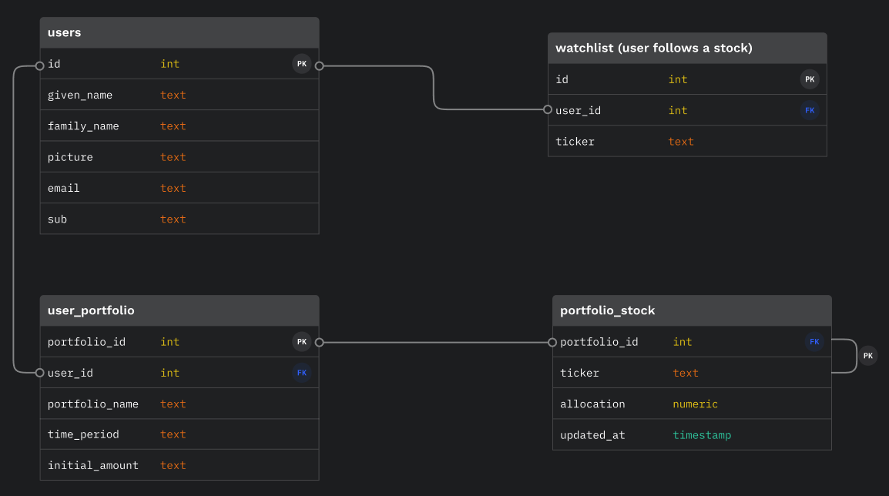

# <div align="center">  </div>

 <p align="center"><b>A beginner-friendly educational tool to learn about stock market investing through <a href="https://www.investopedia.com/terms/b/backtesting.asp" target="_blank">portfolio backtesting</a>* and stock tracking</b></p>
 <sub><i>*Backtesting is the general method for seeing how well a strategy or model would have done ex-post using historical data</i></sub>

## About

[Live Demo on Heroku](https://investory-app.herokuapp.com/) (**See next section for signing in with demo account**)

Want to learn about stock market investing and wonder how your investment ideas would have played out in a particular time period? **Inve$tory** is an educational tool that features portfolio backtesting and stock tracking.

The inspiration of building this passion project originates from being asked by my friends to recommend "the next Bitcoin" or "the next [GME](https://en.wikipedia.org/wiki/GameStop_short_squeeze)". By building **Inve$tory**, I hope to provide a fun beginner-friendly visualization tool for users to learn about not only the _return_ (ending value - initial value) of a portfolio strategy, but more importantly, the _risk_ (how the performance chart fluctuates throughout the time frame) involved.

## Live Demo

[Live Demo on Heroku](https://investory-app.herokuapp.com/)

[Video Demo on Youtube](https://youtu.be/7ZILBkh3q6c)

### Demo account

- **Email**: investory.tester@gmail.com
- **Password**: investor123

## Features

Inve$tory allows users to:

- View a list of daily top gainers and active stocks, and conveniently add them to watchlist
<div align="center">  </div>

- Create a watchlist of stocks that allows for individual stock chart view
  - Add gainers/active stocks directly to watchlist
  - Add a stock to watchlist by searching for a ticker in top search bar
  - Delete stocks from watchlist
- Create customized portfolios and back-test portfolio performance in the specified time frame

  - Customize asset allocations of portfolio stocks
  - Specify preferred time frame and initial investment amount
  - Visualize portfolio performance: portfolio composition, return, performance chart, etc.
  <div align="center">  </div>
  <div align="center">  </div>

- View individual stock details
  - Price chart and daily price changes
  - Company profile
  - Stock stats including open/52-week-high/52-week-low prices, year-to-date changes, market cap, P/E ratio, trading volume
  - Latest news
  <div align="center">  </div>

## Technologies

Inve$tory was built using a PostgreSQL, Express, React, and Node (PERN) stack.

It also uses:

- [IEX Cloud API](https://iexcloud.io/)
- [Auth0](https://auth0.com/docs/get-started)
- [Highcharts](https://www.highcharts.com/)
- [React Hook Form](https://react-hook-form.com/)

## Data Schema

<div align="center">  </div>

## User Flow

<div align="center">  </div>

## Future Plans

- Enrich statistical analysis of portfolios to include more risk measures such as return volatility
- Implement portfolio comparison feature and allow rendering of user-chosen portfolios' charts in one graph
- Expand the universe of investment vehicles to include mutual funds, crypto currencies, etc.
- Support more flexible portfolio strategies such as portfolio rebalancing, recurring investments

## Installation

### Prerequisites

**Docker**

This project relies on Docker to run the PostgreSQL server. You must install Docker first before continuing.

Use one of these methods:

- Use [Homebrew][] on macOS: `brew install --cask docker`
- [Follow the instructions on the Docker website][docker-www]

Once you've installed Docker Desktop, you'll need to launch the app. On macOS,
it's located in `/Applications/Docker`.

**Node**

You'll need to install Node v14 or above. [`nvm`][nvm] is highly recommended.

### Set Up the Development Environment

1. **Clone the repo:**
   ```sh
   git clone https://github.com/xiaozhong21/Investory.git
   ```
2. **Install all NPM packages using this in the root directory:**
   ```sh
   npm install
   ```
3. **Database setup:**

   1. Copy the root example environment file

   ```sh
   cp .env.example .env
   ```

   2. You can choose to edit `POSTGRES_DB` and `POSTGRES_PASSWORD` or just use as-is.
      [See the PostgreSQL Docker image documentation for more
      information][dh-postgres].
   3. Run the following to setup the database with the seed file:

   ```sh
   npm run db:init
   ```

   ℹ️ If you ever need to start over with the database, you can run this command
   again which will delete your existing data and start from scratch.

4. **Environment variables setup.** For full-feature site, you will need to set up `auth0` environment variables and API key for IEX Cloud:

   1. Auth0 setup

      1. Connect Express server with Auth0: In the copied root `env` file, set up Auth0 domain and audience
         - These can be obtained by signing up for an Auth0 account and [Registering a Single-Page Web Application](https://auth0.com/docs/get-started) in order to get these values.
         - [Auth0's guide](https://auth0.com/blog/complete-guide-to-react-user-authentication/#Calling-an-API)
      2. Connect React with Auth0: Copy the app's example environment file and set up Auth0 domain + client-id

         ```sh
         cp app/.env.example app/.env
         ```

         - This [graphic](https://images.ctfassets.net/23aumh6u8s0i/1DyyZTcfbJHw577T6K2KZk/a8cabcec991c9ed33910a23836e53b76/auth0-application-settings) may be helpful to locating the values
         - [Auth0's guide](https://auth0.com/blog/complete-guide-to-react-user-authentication/#Connect-React-with-Auth0)

   2. IEX Cloud API Key setup by signing up for an account on their [site](https://iexcloud.io/)

### Start the Development Environment

```sh
npm start
```

Visit <http://localhost:3000>.

### Shut Down the Development Environment

1. `Ctrl-C` to stop the Express and React development servers.
1. `npm stop` to stop and destroy the PostgreSQL Docker container. Don't worry,
   your data is safe.

### Need to Start a `psql` Session?

```sh
npm run psql
```

[dh-postgres]: https://hub.docker.com/_/postgres
[docker-www]: https://docs.docker.com/get-docker/
[homebrew]: https://brew.sh
[nvm]: https://github.com/nvm-sh/nvm

## Contributors ✨

Thanks goes to these wonderful people ([emoji key](https://allcontributors.org/docs/en/emoji-key)):

<!-- ALL-CONTRIBUTORS-LIST:START - Do not remove or modify this section -->
<!-- prettier-ignore-start -->
<!-- markdownlint-disable -->
<table>
  <tr>
   <td align="center">
     <a href="https://github.com/gsong">
     <br /><sub><b>George Song</b></sub></a><br />
     <a href="https://github.com/xiaozhong21/Investory/pull/3" title="Review">👀</a> 
     <a href="#mentoring-gsong" title="Mentoring">🧑‍🏫</a>
     <a href="#question-gsong" title="Answering Questions">💬</a>
     <a href="https://github.com/xiaozhong21/Investory/issues?q=is%3Aissue+is%3Aclosed" title="Bug Reports">🐛</a>
   </td>
   <td align="center">
     <a href="https://github.com/scabaral">
     <br /><sub><b>Sara Cabaral</b></sub></a><br />
     <a href="https://github.com/xiaozhong21/Investory/pull/8" title="Review">👀</a>
     <a href="#mentoring-scabaral" title="Mentoring">🧑‍🏫</a>
     <a href="#question-scabaral" title="Answering Questions">💬</a>
   </td>
   <td align="center">
     <a href="https://github.com/cdm-ium">
     <br /><sub><b>Costandino Dufort Moraites</b></sub></a><br />
     <a href="https://github.com/xiaozhong21/Investory/pull/3" title="Review">👀</a> 
     <a href="#mentoring-cdm-ium" title="Mentoring">🧑‍🏫</a>
     <a href="#question-cdm-ium" title="Answering Questions">💬</a>
   </td>
   <td align="center">
     <a href="https://www.linkedin.com/in/xiaozhong/">
     <br /><sub><b>Xiao Zhong</b></sub></a><br />
     <a href="https://github.com/xiaozhong21/Investory/commits?author=xiaozhong21" title="Code">💻</a>
     <a href="https://github.com/xiaozhong21/Investory/commits?author=xiaozhong21" title="Documentation">📖</a> 
     <a href="#design-xiaozhong21" title="Design">🎨</a> 
     <a href="#ideas-xiaozhong21" title="Ideas & Planning">🤔</a>
     <a href="https://github.com/xiaozhong21/Investory/commits?author=xiaozhong21" title="Project Management">📆</a>
     <a href="#maintenance-xiaozhong21" title="Maintenance">🚧</a>
     <a href="https://github.com/xiaozhong21/Investory/commits?author=xiaozhong21" title="Test">⚠️</a> 
   </td> 
  </tr>
</table>

<!-- markdownlint-restore -->
<!-- prettier-ignore-end -->

<!-- ALL-CONTRIBUTORS-LIST:END -->

This project follows the [all-contributors](https://github.com/all-contributors/all-contributors) specification. Contributions of any kind welcome!
